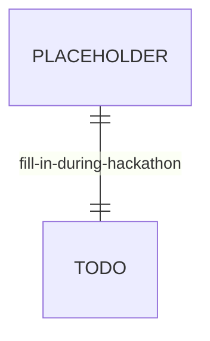

# Entity-Relationship diagram

Status: scaffold — fill in during the hackathon once the DDL is written.
Owner: Abdul Qayyum + Asad.

Mermaid renders natively in GitHub. Keep this file in sync with
`db/ddl/01_create_tables.sql` and `db/schema_descriptions.yaml`.

## Conventions

- `||--o{` — one-to-many
- `||--||` — one-to-one
- `}o--o{` — many-to-many
- PK / FK annotations on the column line
